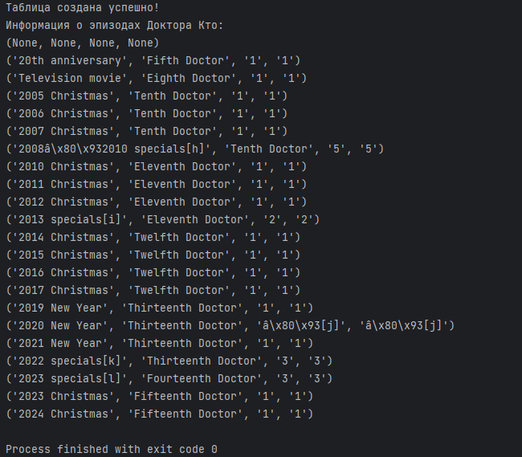
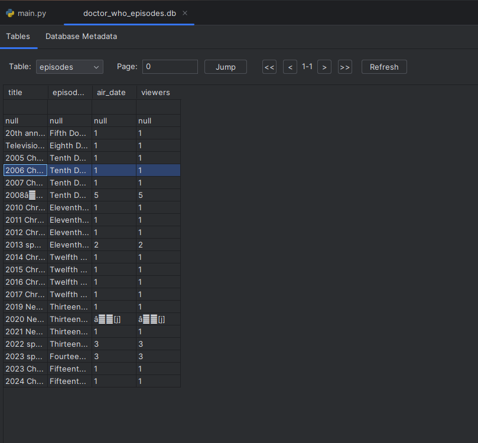

# lab16  

## Задание
    Реализуйте парсер с использованием Selenium для сбора данных с веб-страницы. Это может быть:
        онлайн-каталог
        интернет-магазин
        энциклопедия и т.д.

Основное требование: чтобы ресурсы не повторялись внутри группы, т.е. все должны парсить разные сайты.

    Создайте таблицы БД и заполните их данными, полученными с помощью парсера. У вас должно быть минимум 2 таблицы. При заполнении в запросах используйте именованные плейсхолдеры драйвера вашей СУБД.
    Напишите запросы для выборки данных из БД с использованием PyPika Query Builder. У вас должно быть:
        2 запроса с JOIN
        3 запроса с расчётом статистики/группировкой/агрегирующими функциями
    Оформите отчёт в README.md. Отчёт должен содержать:
        Условия задач
        Описание проделанной работы
        Скриншоты результатов
        Ссылки на используемые материалы
## Проделанная работа

## Скриншоты

## Список использованных источников
[лаба](https://evil-teacher.on.fleek.co/prog_pm/term2/lab16/)   

[статья которая помогла](https://habr.com/ru/articles/513218/)   

